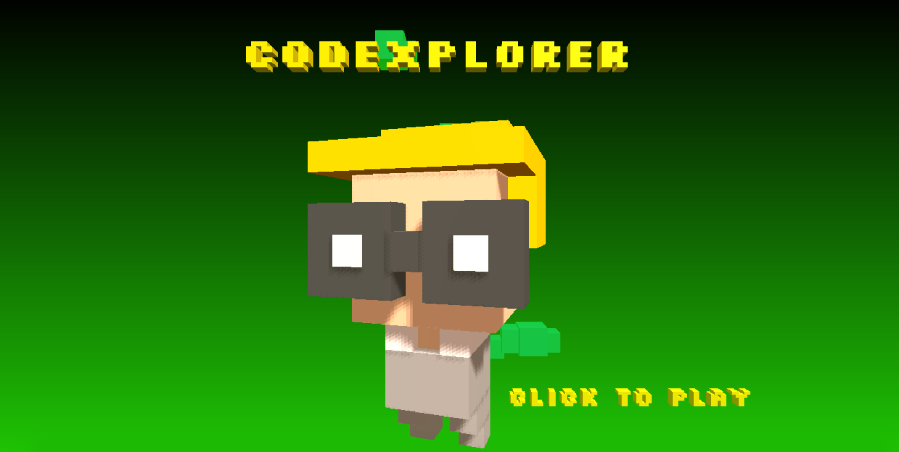
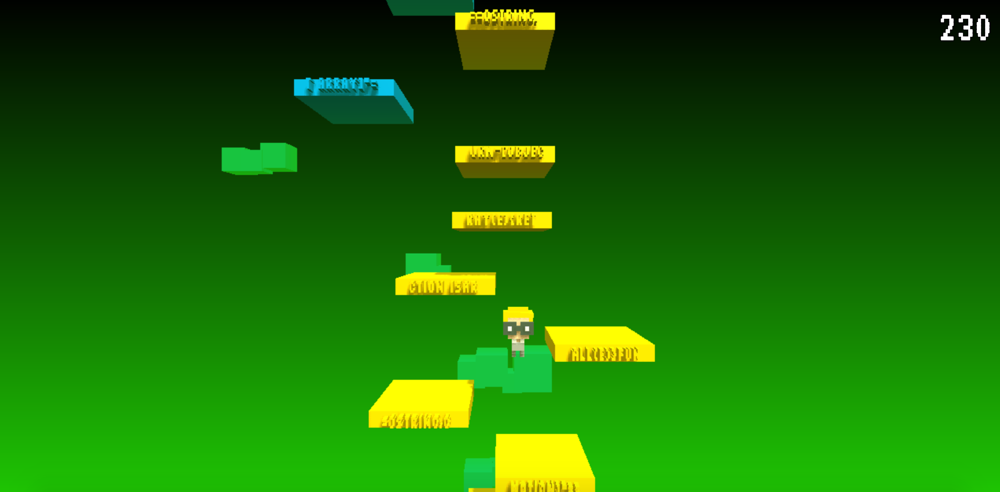

# Codexplorer

[PLAY ME WITH YOUR MOUSE](https://michalbe.github.io/game-off-2016/dist/)

## What?
Codexplorer is a simple jumping game with WebGL graphics and [quine](https://en.wikipedia.org/wiki/Quine_(computing))-like platform generation.

## How?
Use your mouse to help tiny brave voxel programmer to reach the end of the source code. Touch controls will be added in my next free time slot.

As every quine program, Codeplorer displays it's own source code as an output. It's divided into 10 character long chunks and rendered on the platforms, defining their behavior - if there is a `function`, `for`, `new`, `window` or `return` string in the platform it's getting green and gives your hero super speed. Platforms with `var`, `new`, `interval`, `timeout`, `array` or `call` are blue, moving obstacles with random speed. __Thats the hacking part of the game - to change the order of the platforms you need to change the source code of the game.__

## Why?
I found a pixelart character in one of the `trash` folders in my `development` directory called `it-guy.png`. It was probably drawn by me a while ago for one of my games, or stolen from somewhere gods only know why (if you feel like I should give you credits for it, let me know). I thought it would be nice to give a second chance to this little fellow, so I rewritten him in voxels instead of pixels.

I also always wanted to dig deeper into the [quines](http://www.madore.org/~david/computers/quine.html). Since I'm not motivated enough nowadays to work on any side projects, Github's Game Off was the first time in a while when I could focus on one. And here it is. Enjoy!

[PLAY ME WITH YOUR MOUSE](https://michalbe.github.io/game-off-2016/dist/)
